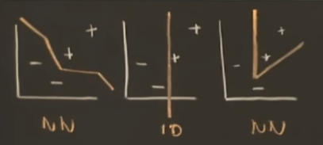
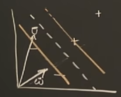

# Support Vector Machines 支持向量机	

> 前提：经过了感知器等基本概念的学习，我们以及知道如何训练出可以用于解决分类问题的超平面
>
> 说明：本文将讨论一个同样能够完成分类问题的较为复杂的想法——支持向量机 SVM（Support Vector Machines）
>
> 它由 美国计算机学家 Vladimir Vapnik 提出，用来确定分类问题的决策边界
>
> 参考：https://www.youtube.com/watch?v=_PwhiWxHK8o

##  Intro 引入

目前我们有很多方法能够画出各种决策边界

Vapnik 对此提出：

- 对空间中的线性可分的两类样本，要画出决策边界，无非是一个超平面，但是选择哪一个边界是个问题。
- 例如下图的例子，我们希望的是画出一个与两类样本间隔最宽的直线（下图虚线），把这个空白的间隔范围（两个橙色线之间）想象成一个***沟渠***。

- 其中，$\vec{\omega}$ 是垂直于决策边界的任意长度向量，$\vec{v}$ 是我们想判断分类的样本点

- 如果 $\vec{w}\cdot\vec{u}\geq C$ 那么样本很明显是在直线右侧的一类（+）

- 换个方式来描述这个分类规则, 令 $C=-b$，有 :

- $$
  \vec{w}\cdot\vec{u}+b\geq 0 , THEN (+) , [*公式1]
  $$

  - $\vec{u} $ 是我们已知，待分类的样本
  - $\vec{\omega}$ 和  $b$ ，分别是我们需要进一步确定的 权值 和 偏置
  - 由于我们希望确定一个唯一的最优结果，所以我们要考虑这个优化问题的限制。

## Support Vector 支持向量

对于我们已知的训练集，它包含两类样本，分别是$x_+$和$x_-$
$$
\vec{\omega}\cdot\vec{x_+}+b \geq 1 , 对于+样本\\
\vec{\omega}\cdot\vec{x_-}+b \leq -1, 对于-样本
$$

- 这两类样本之间存在一个空白区域从-1到1

我们引入一个变量$y_i$来明确第$i$个样本属于哪一类：
$$
y_i=+1, 对于+样本\\
y_i=-1, 对于-样本
$$
这样我们将得到
$$
y_i(\vec{w} \cdot \vec{x_i}+b) \geq 1
$$
把1移到左边
$$
y_i(\vec{w} \cdot \vec{x_i}+b) -1\geq 0, [*公式2]
$$
如果 $y_i(\vec{w} \cdot \vec{x_i}+b) -1= 0$, 这个样本$\vec{x_i}$在沟渠边界，其实就是支持向量，如下图在两个边界上的点

- 这个间隔的宽度等于正负边界上的支持向量的差$(\vec{x_+}-\vec{x_-})$乘上垂直于边界的单位方向向量，在前面我们有$\vec{\omega}$ 是垂直于决策边界的任意长度向量，那么它除以自身的模就是单位向量了，因此有：
  $$
  Width = (\vec{x_+}-\vec{x_-})\cdot \frac{\vec{w}}{||\vec{w}||}
  $$

## Max the width 最大间隔问题

- 从**[*公式2]**可以知道对于一个支持向量$\vec{x_+}$ 有：
  - $y_i(\vec{w} \cdot \vec{x_+}+b) -1= 0$
  - $ y_i=+1, 对于+样本$
  - 因此：$\vec{w} \cdot \vec{x_+}=1-b$
- 类似的对于支持向量$\vec{x_-}$
  - $y_i(\vec{w} \cdot \vec{x_-}+b) -1= 0$
  - $y_i=-1, 对于-样本$
  - 因此：$\vec{w} \cdot \vec{x_-}=-1-b$
  - $\vec{w} \cdot \vec{x_+}-\vec{w} \cdot \vec{x_-}=1-b-(-1-b)=2$

- 所以宽度公式可以进一步表示为
  $$
  Width = (\vec{x_+}-\vec{x_-})\cdot \frac{\vec{w}}{||\vec{w}||}=\frac{2}{||\vec{w}||},[*公式3]
  $$

- 我们的问题就在于如何得到最大的间隔宽度$Width$

- 忽略掉常数，我们需要最大化$\frac{1}{||\vec{w}||}$，也就是要最小化${||\vec{w}||}$
- 更进一步，最小化$\frac{1}{2}{||\vec{w}||}^2$, 这种形式方便我们直接套用数学上的优化问题的解决方法——拉格朗日公式

##  Lagrange mutipliers 拉格朗日乘子

- 对于一个有限制（边界条件）的函数，用拉格朗日乘子可以求函数的极值

- $$
  L=\frac{1}{2}{||\vec{w}||}^2-\sum\alpha_i[y_i(\vec{w} \cdot \vec{x_i}+b) -1]
  $$

  - L 表示我们要最大化的量
  - $\alpha_i$ 是拉格朗日乘子，支持向量对应的是1，其他的是0
  -  $y_i(\vec{w} \cdot \vec{x_i}+b) -1$是限制条件
  - 如果需要进一步了解可以参考https://zhuanlan.zhihu.com/p/542402242

- 要求一个函数的极值，我们可以先求导来判断
  $$
  \frac{\partial L}{\partial \vec{w}}=\vec{w}-\sum\alpha_iy_i\vec{x_i}=0
  $$

  - 对于向量的求导我们不做展开说明，其基本形式与标量类似，特殊情况我们再做说明。

  - $$
    \vec{w}=\sum\alpha_iy_i\vec{x_i},[*公式4]
    $$

- 接下来我们对$b$求偏导

$$
\frac{\partial L}{\partial b}=-\sum\alpha_iy_i=0
$$

- $$
  \sum\alpha_iy_i=0,[*公式5]
  $$

- 我们把[*公式4]带入到拉格朗日公式里得到

$$
L=\frac{1}{2}{(\vec{w})}^2-\sum\alpha_iy_i\vec{x_i}(\vec{w})-\sum\alpha_iy_ib+\sum\alpha_i\\
=\frac{1}{2}{(\sum\alpha_iy_i\vec{x_i})}\cdot{(\sum\alpha_jy_j\vec{x_j})} ①\\-(\sum\alpha_iy_ix_i)\cdot(\sum\alpha_jy_j\vec{x_j})②\\-\sum\alpha_iy_ib③+\sum\alpha_i④
$$

- 上面的结果一共有①-④项，我们来分析一下

  - ①和②是同类项，合并后系数为$-\frac{1}{2}$
  - ③中b对于求和来说是常数，可以提出来，由$\sum\alpha_iy_i=0,[公式5]$发现③项等于0
  - ④项保留

- $$
  L=-\frac{1}{2}{(\sum\alpha_iy_i\vec{x_i})}\cdot{(\sum\alpha_jy_j\vec{x_j})} +\sum\alpha_i
  $$

- 最终得到

- $$
  L=\sum\alpha_i-\frac{1}{2}\sum_i\sum_j\alpha_i\alpha_jy_iy_j  \vec{x_i}\cdot\vec{x_j}, [*公式6]
  $$

  至此，我们所有的问题都转化为了，求[*公式6]这个表达式的最大值

> 这个形式清楚的表达了，这个最大值与这些样本向量（训练集）的关系。
>
> 我们发现这个最优值取决于这些样本，它们两两之间的内积，也就是**$\vec{x_i}\cdot \vec{x_j}$**

- 同样带入[公式4]我们的决策条件（分类规则）[*公式1]也变成了：

- $$
  \sum\alpha_iy_i\vec{x_i}\cdot\vec{u}+b\geq 0 , THEN (+)
  $$

> 分类规则也同样取决于训练集的样本（支持向量）和测试样本之间的内积，**$\vec{x_i}\cdot \vec{u}$**

## Kernel Function 核函数

在当前维度，如果样本线性不可分，可以使用核（Kernel）来把样本映射到更高维的空间，使样本线性可分。
$$
\vec{x} \rightarrow \phi(\vec{x})
$$
上一小节我们得出结论：无论是优化问题还是分类规则都与样本向量两两间的内积有关，因此我们可以考虑映射后的内积的表达

- 对于$L$, 需要求：

$$
\phi(\vec{x_i})\cdot\phi(\vec{x_j})
$$

- 对于分类规则，需要：

$$
\phi(\vec{x_i})\cdot\phi(\vec{u})
$$

因此我们定义核函数为：
$$
K(\vec{x_i},\vec{x_j})=\phi(\vec{x_i})\cdot\phi(\vec{x_j})
$$
我们甚至无需确定映射的规则（$\phi(\vec{x})$ 的表达式）,只需要知道核函数$K(\vec{x_i},\vec{x_j})$ 的表达式足矣

- 几种常用的核函数：

  - $$
    K(u,v)=(u^T\cdot v+1)^n
    $$

    

  - $$
    K(u,v)=u^T\cdot v
    $$

  - $$
    K(u,v)=e^{-\frac{||u-v||}{\sigma}}
    $$
